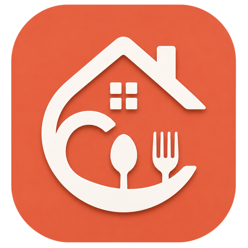

<p align="center">
  
</p>

<h1 align="center">🏡 Cottage</h1>
<p align="center"><b>Shared-house living, sorted: meals, bazaar duty, utilities, and notices in one calm dashboard.</b></p>

<p align="center">
  
  
  
  
  
</p>

<p align="center">
  <a href="#-features">Features</a> ·
  <a href="#-tech-stack">Tech Stack</a> ·
  <a href="#-getting-started">Getting Started</a> ·
  <a href="#-project-structure">Structure</a> ·
  <a href="#-design-language">Design</a>
</p>

---

## About

Splitting rent is easy. Splitting *everything else* is not, who cooked, who shopped, who paid the electricity bill, who owes what this month. **Cottage** turns that spreadsheet chaos into one shared source of truth for every member of the house.

It's the native mobile counterpart to Cottage's Next.js web app, built on the same [Supabase](https://supabase.com) project, so a change on one surface shows up instantly on the other. Log a meal on the web at lunch, see the updated balance on your phone by dinner.

## ✨ Features

<table>
<tr><td width="46">🏠</td><td><b>Dashboard</b><br/>The daily snapshot: live meal & utility balances, the pinned notice, this month's bazaar duty roster, recent utility expenses, and a per-member meal summary. Pull to refresh at any time.</td></tr>
<tr><td>🍽️</td><td><b>Meal Tracking</b><br/>A tabbed monthly ledger, <i>Meal Details</i> for daily counts and the running per-meal rate, <i>Bazar</i> for grocery purchases, <i>Deposit</i> for meal-fund contributions. Every entry is editable and totals recalculate automatically.</td></tr>
<tr><td>🛒</td><td><b>Bazaar Duty Roster</b><br/>A shared rota showing each member's grocery-shopping window, with whoever's on duty highlighted at a glance and full details a tap away.</td></tr>
<tr><td>💡</td><td><b>Utilities</b><br/>Log shared bills by category (electricity, gas, water, internet, rent, maintenance, and more), record deposits, and see a per-member <i>Dues</i> breakdown with clear paid/due status.</td></tr>
<tr><td>📢</td><td><b>Notice Board</b><br/>A cottage-wide announcement feed across <i>Feed</i>, <i>Scheduled</i>, and <i>History</i> tabs. Notices carry a type and priority, and admins can pin, archive, or restrict visibility.</td></tr>
<tr><td>🔔</td><td><b>Notifications</b><br/>An in-app bell and activity list, sorted by source, backed by Firebase Cloud Messaging so alerts land even when the app is closed.</td></tr>
<tr><td>👥</td><td><b>Members & Menu</b><br/>Your profile card, the active billing month, a member directory, and quick links to History, Contacts, and Settings.</td></tr>
<tr><td>🔐</td><td><b>Authentication</b><br/>Email/password and native Google sign-in (in-app account picker, no browser hop), plus password recovery, all backed by Supabase Auth.</td></tr>
</table>

## 🧱 Tech Stack

| Layer | Technology |
|---|---|
| Framework | [Flutter](https://flutter.dev) (Dart SDK `^3.12.2`) |
| Backend, Auth & Database | [Supabase](https://supabase.com) (`supabase_flutter`) |
| Push Notifications | Firebase Cloud Messaging + `flutter_local_notifications` |
| Sign-In | Native Google Sign-In (`google_sign_in`) via Supabase ID-token exchange |
| Typography | Google Fonts (Poppins, Outfit) + bundled Plus Jakarta Sans |
| Icons | `lucide_icons_flutter`, matching the web app's icon set |
| Sharing | `share_plus` + `path_provider` for generated invoice images |

**Architecture:** feature-first (`lib/features/<name>/{data,presentation}`), plain `StatefulWidget` + `Future`/`FutureBuilder` for state (no external state-management package), a global `ValueNotifier<ThemeMode>` for light/dark theming, and a key-based `NavigationService` for context-free navigation. Brand colors and design tokens mirror the web app's design system so both clients feel like one product.

## 📱 Supported Platforms

Android · iOS · macOS · Windows · Linux · Web, all six Flutter targets are scaffolded in this repo.

## 🚀 Getting Started

### Prerequisites
- [Flutter SDK](https://docs.flutter.dev/get-started/install) (Dart `^3.12.2`)
- A Supabase project (URL + anon key)
- *(Optional, for push notifications)* A Firebase project

### 1. Clone & install dependencies

```sh
git clone https://github.com/moinul-rehan/Cottage-App-Flutter.git
cd Cottage-App-Flutter
flutter pub get
```

### 2. Configure Supabase credentials

Cottage reads `SUPABASE_URL` and `SUPABASE_ANON_KEY` at **build time** via `--dart-define` (see [`lib/helpers/supabase_service.dart`](lib/helpers/supabase_service.dart)), there's no runtime `.env` file. Without them, the app builds fine, but every screen that talks to Supabase (starting with login) will fail.

```sh
cp env.json.example env.json
# then fill in your own project's URL and anon key
```

Run the app with the credentials injected:

```sh
flutter run --dart-define-from-file=env.json
```

> ⚠️ **Release builds must pass the flag explicitly.** A plain `flutter build apk --release` (or Android Studio's *Build > Build APK(s)*) silently ships a broken build that can't log in. Use the provided script instead:
> ```sh
> ./build_release.sh      # macOS / Linux / WSL
> ./build_release.ps1     # Windows PowerShell
> ```

### 3. *(Optional)* Enable push notifications

Native push needs a separate Firebase project:

1. Create a project at [console.firebase.google.com](https://console.firebase.google.com).
2. Add an Android app with package name `com.cottage.cottage`.
3. Download `google-services.json` and place it at `android/app/google-services.json` (gitignored, the app still builds without it, just with push disabled, see [`PushNotificationService`](lib/helpers/push_notification_service.dart)).
4. For the backend to *send* pushes, generate a service-account key (Firebase Console → Project Settings → Service Accounts) and configure it on the web app's side.

### 4. *(Optional)* Enable native Google Sign-In

1. In [Google Cloud Console](https://console.cloud.google.com/apis/credentials), create an **OAuth 2.0 Client ID** of type *Web application* (redirect URI: your Supabase project's `/auth/v1/callback`), and paste its Client ID + Secret into Supabase → Authentication → Providers → Google.
2. Create a second **Android**-type Client ID with your app's package name and signing SHA-1 fingerprint, this is what lets the native account picker launch for your build.

## 📂 Project Structure

```
lib/
├── common_widgets/     # Shared UI: app scaffold, bottom nav shell, bottom sheets, empty states
├── constants/          # App name, theme (CottageColors, CottageSurface)
├── features/
│   ├── auth/            # Login, signup, forgot password, native Google sign-in
│   ├── dashboard/        # Home screen: summaries, roster, notices, expenses
│   ├── meal/             # Meal details, bazar purchases, deposits
│   ├── bazaar_duty/      # Grocery-duty roster
│   ├── utilities/        # Utility expenses, deposits, dues
│   ├── menu/              # Settings hub + member directory
│   ├── notices/          # Notice board (feed / scheduled / history)
│   └── notifications/    # In-app notification center
├── helpers/             # Supabase client, push notifications, navigation, formatting
├── models/              # Shared data models (e.g. Profile)
└── main.dart            # App entry point, theming, auth gate
```

## 🎨 Design Language

Cottage's UI mirrors the web app's design tokens for a consistent cross-platform feel: a warm brand orange (`#E66140`) drives buttons and active states, with dedicated light/dark surface palettes and status-tone colors (blue, green, orange, red) for badges and balances throughout the app.

## 📄 License

All rights reserved. See [`LICENSE`](LICENSE), this repository is public for portfolio and reference purposes only; no permission is granted to copy, modify, or redistribute the code.

---

<p align="center"><sub>Built with Flutter · Powered by Supabase</sub></p>
